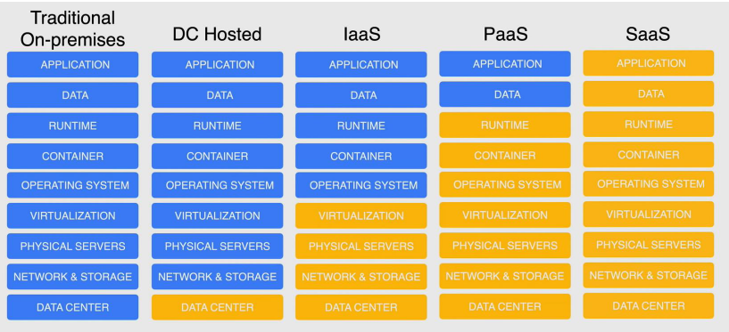
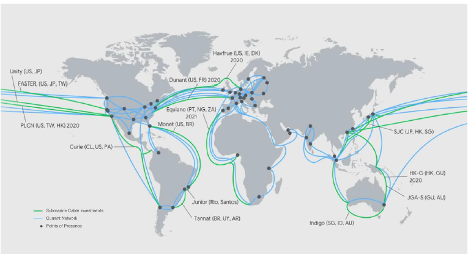

# Associate Cloud Engineer
### What is Cloud Computing?
#### https://ag143.github.io/GCPACE/host.html
#### [https://ag143.github.io/GCPACE//ACE/GCPACE_slides.md](https://github.com/ag143/GCPACE/blob/main/ACE/28minGCPACE/gcpace28min.md)
The delivery of a shared pool of on-demand computing services over the public internet that can be rapidly provisioned and released with minimal management effort or service provider interaction.
### The 5 characteristics of Cloud:
1. On-demand Self Service
- Provision resources automatically without requiring human interaction
2. Broad Network Access
- Available over the network
3. Resource Pooling
- Pooled resources to support a multi-tenant model allowing multiple customers to share the same applications or the same physical infrastructure
4. Rapid Elasticity
- Rapidly provision and de-provision any of the cloud computing resources
5. Measured Service
- Resource usage can be monitored, controlled and reported using metering capabilities
### Cloud Deployment Models
Public Cloud- 1 public cloud
Multi Cloud - 2 or more public Clouds
Private Cloud - on-premises cloud
Hybrid Cloud – private Cloud + public cloud
Hybrid Environment - on-premise data center + public cloud
### Cloud Service Models

img reference</img>
### Google Cloud Global Infrastructure
13 Subsea Cables; Hundreds of thousands of miles of fiber cables

### Zone
- A zone is a deployment area for Google Cloud resources within a region. The smallest entity in Google's global network
- A single failure domain within a region
- Deploy closer to users for optimal latency.
### Region
- Regions are independent geographic that are sub-divided into zones areas.
- For fault tolerance and high availability
- Intercommunication <5ms between zones within a region
### Multi-Region
- Multi-Regions are large geographic areas, that contain two or more regions
- Allows Google services to maximize redundancy and distribution within and across regions.
- High availability (geo-redundant)
### Overview of Compute Service Options
#### compute Engine
- Virtual Machines (VMs) called instances.
- Choose region and zone to deploy.
- You decide the operating system and the software you decide to put on it.
- Use public or private images to create instances.
- Pre-configured images and software packages available in Google Cloud Marketplace
#### GKE
- Container-orchestration system for automating deploying, scaling, and managing containers
- Built on open-source Kubernetes.
- Flexibility to integrate with on-premises Kubernetes.
- Uses Compute Engine instances as nodes in a cluster.
- A cluster is a group of nodes or Compute Engine instances.
#### App Engine
- Fully managed, serverless platform for developing and hosting web applications at scale (PaaS)
- Provisions servers and scales your app instances based on demand.
- Build your app in Go, Java, .NET, Node.js, PHP, Python, or Ruby
- Connect with other Google services seamlessly.
- Integrates with Web Security Scanner to identify threats
#### Cloud Functions
- Serverless execution environment for building and connecting cloud services.
- Simple, single-purpose functions that are attached to events.
- Triggered when an event being watched is fired.
- Your code executes in a fully managed environment.
- No need to provision any infrastructure.
- Cloud Functions can be written using JavaScript, Python 3, Go, or Java runtimes
- Use Cases:
o Data processing or ETL operations (video transcoding)
o Webhooks to respond to HTTP triggers.
o APIs that compose loosely coupled logic.
o Mobile backend functions
o FaaS
#### Cloud Run
- Fully managed compute platform for deploying and scaling containerized applications quickly and securely.
- Built upon an open standard Knative
- Abstracts away all infrastructure management.
- Known as serverless for containers.
- Any language, any library, any binary
- Considered FaaS
### Overview of Storage and Databases
#### CLoud Storage
- Consistent, scalable, large-capacity, highly durable object storage
- 11 9's Durability (99.999999999%)
- Unlimited storage with no minimum object size
- Use Cloud Storage for content delivery, data lakes and backup.
- Available in different storage classes and availability
### Storage Classes
Standard
Maximum
availability
No limitations
Nearline
Low-cost archival
storage
Accessed <1 Imo
Coldline
Even lower cost
archival storage
Accessed <1 /qtr
Archive
Lowest cost
archival storage
Accessed <1 /yr
### File Store
- Fully managed NFS file server
- NFSv3 compliant
- Store data from running applications.
- Use with VM instances and Kubernetes clusters.
### Persistent Disks
- Durable block storage for instances
- Two types:
o Standard
o Solid State (SSD) Lower latency higher iops
- Available in zonal and regional options
### Database Options
Two types:
- SQL
- NoSQL
#### SQL
##### Cloud SQL
- Fully managed database service
- PostgreSQL, MySQL, and SQL Server
- High availability across zones
##### Cloud Spanner
- Scalable relational database service
- Support transactions, strong consistency, and synchronous replication
- High availability across regions and globally
#### NoSQL
##### Bigtable
Fully managed, scalable NoSQL database
High throughput with low latency
Cluster resizing without downtime.
##### Datastore
- Fast, fully managed, serverless, NoSQL document database
- For mobile, web and IoT apps
- Multi-region replication ACID transaction s
##### Firestore
- NoSQL, realtime database
- Optimized for offline use.
- Cluster resizing without downtime.
##### Memorystore
- Highly available in-memory service for Redis and Memcached
- Fully Managed
### Overview of Networking Services
#### VPC
- Virtualized network within Google Cloud
- Core networking service
- Global resource
- Each VPC contains a default network.
- Additional networks can be created in your project, but networks cannot be shared between projects.
Firewall Rules
- Govern traffic coming into instances on a network.
- Default network has a default set of firewall rules.
- Custom rules can be created
Routes
- Advanced networking functions for your instances
- Specifies how packets leaving an instance should be directed
### Load Balancing
HTTP(S) Load Balancing
- Distribute traffic across regions to ensure that requests are routed to the closest region or, in the event of a failure or over-capacity, to a healthy instance in the next closest region.
- Distribute traffic based on content type
Network Load Balancing
- Distribute traffic among server instances in the same region based on incoming IP protocol data, such as address, port, and protocol
### Cloud DNS
#### Google Cloud DNS
- Publish and maintain DNS records by using the same infrastructure that Google uses.
- Work with managed zones and DNS records through the CLI, API, or SDK
### Advanced Connectivity
Cloud VPN
Connect your existing network to your VPC through an IPsec connection.
Direct Interconnect
Connect an existing network to your VPC using a highly available, low-latency, enterprise-grade connection.
Direct Peering
Exchange internet traffic between your business network and Google at one
of Google's broad-reaching edge network locations
Carrier Peering
Connect your infrastructure to Google's network edge through highly available, lower-latency connections by using service providers
### Resource Hierarchy
Configure and grant access to the various resources.
### What is a resource?
#### Service-level resources
- Compute Instance VM's
- Cloud Storage buckets
- Cloud SQL databases
#### Account-level resources
- Organization
- Folders
- Projects
### Resource Hierarchy Structure
- Resources are organized hierarchically using a parent/child relationship.
- Designed to map organizational to Google Cloud structure.
- Better management of permissions and access control
- Policies controlled by IAM
- Access control policies and configuration settings on a parent inherited by the child resource are
- Each child object has exactly one
parent.
### Billing Account
- Defines who pays for a given set of Google Cloud resources
- Tracks all costs incurred by Google Cloud usage.
- Linked to a Payments profile.
- Can be linked to one or more projects.
- Billing specific roles and permissions to control access.
- Self-service (online) or Invoiced (offline) payments available.
- Sub-accounts can be used for resellers.
- Billing account can pay for projects in a different organization.
- Projects that are not linked to a Cloud Billing account cannot use paid Google Cloud services
### Payments Profile
- Processes payments for all Google services
- Stores all payment methods.
- Single pane of glass for viewing invoices and payment history
- Controls who can view and receive invoices.
- Individual or Business profile types - cannot be changed.
NOTE: If one is a regular user and wants to change the billing account for a project then we need to have the permission for Billing Account Administrator and Project Owner role in order to change the billing account.
### Cost Management and Budget Alerts
#### Committed Use Discounts (CUD's)
Discounted prices when you commit to using a minimum level of resources for a specified term.
1- or 3-Year Commitment
Commitment Types:
- Spend-based.
- Resource-based
The commitment fee is billed monthly.
#### Spend-based Commitment
- Discount for a commitment to spend a minimum amount for a service (hours) in a particular region.
- 25% discount for 1 year - 52% discount on a 3 year.
- Available for
o Cloud SQL database instances
o Google Cloud VMWare Engine
- Applies only to CPU and memory usage.
#### Resource based commitment
- Discount for a commitment to spend a minimum amount for Compute Engine resources in a particular region.
- Available for
o vCPU, Memory, GPU and Local SSD
- 57% discount for most resources
- 70% for memory-optimized machine types
- For use across Projects
#### Sustained-use Discounts
- Automatic discounts for running Compute Engine resources a significant portion of the billing month.
- Applies to vCPUs and memory for most Compute Engine instance types.
- Includes VM's created by GKE.
- Does not apply to App Engine flexible, Dataflow and E2 machine types.
NOTE: Not applicable for preemptible VM’s
### Cloud Billing Budgets
Enables you to track your actual Google Cloud spend against your planned spend
Budget alert threshold rules that are used to trigger email notifications to help you stay informed about your spend.
Define the scope of the budget.
- Spend of billing account or more granular
Budget amount can be set to a specified total or based previous month’s spend
Alert emails are sent to billing account admins and specific users when costs exceed a percentage of the budget.
Email recipients can be customized by using Cloud Monitoring to specify other people to receive budget alert emails
Use Pub/Sub for programmatic notifications or to automate cost management tasks
### Exporting Billing Data
Billing export enables granular billing data (such as usage, cost details, and pricing data) to be exported automatically to BigQuery for detailed analysis
Not Retroactive
NOTE: BigQuery Data Transfer Service API needs to be enabled
### Super Admin Account
- Irrevocable admin permissions
- Grant Organization Admin role (or any other role)
- Recover accounts at the domain level
### Cloud SDK
gcloud command format
### Managing Cloud SDK
gcloud init -> To initialize the SDK with the Google Cloud account
gcloud auth list -> To see the accounts available
gcloud config set account `ACCOUNT` -> To change the account
gcloud config list -> Shows the active configuration
gcloud config configuration activate default -> To activate the default configurations
gcloud components list -> To list the components (bq, kubectl, etc.)
gcloud components install/remove kubectl -> To install /remove the kubectl component
gcloud components install beta -> To install the beta component to prompt and auto complete
gcloud beta interactive -> Loads the shell for prompt and auto complete
curl metadata/computeMetadata/v1/instance/zone -> To know where the cloudshell is present
To setup our custom tools installations in the cloud shell, we need to setup a file:
.customize_environment
NOTE: If we do not login into the cloudshell for 120 days, the persistent disk will be deleted.
### Limit and Quotas
Hard limit on how much of a particular Google Cloud resource your project can use.
### Rate Quota: Rests after specified time
### Allocation Quota: Must be explicitly released
Enforcement of Quotas:
- Protection
- Resource Management
- Countable
### 2 ways to view quotas:
- In IAM & Admin section, we have the Quotas option where we can see and request for more resources for the same.
- Under API & Services Dashboard we can select a particular API and view every granular details of quotas for each API.
### Cloud IAM
Concept of Least Privileges: A user, program, or process should have only the bare minimum privileges necessary to perform its function.
Cloud IAM lets’ you manage access control by defining who, has what access for which resource.
### Policy Architecture
Policy Architecture
Members
### Permissions
- Determines what operations are allowed on a resource.
- Correspond one-to-one with REST API methods.
- Not granted to users directly
- You grant roles which contains one or more permissions.
➔ Eg: compute.instances.list
service.resource.verb
### Roles:
- Collection of permissions
- You cannot grant a permission to the user directly
- You grant a role to a user and all the permissions that the role contains.
### Types of Roles:
- Primitive and Predefined are maintained by Google Cloud.
- Custom Roles are created by user (Project Owners).
- Some Predefined roles cannot be used by Custom Roles.
### Conditions:
Used to define and enforce conditional, attribute-based access control for Google Cloud resources.
Conditions allow you to choose granting resource access to identities only if configured conditions are met.
### Metadata:
To help prevent a race condition when updating the policy, IAM supports concurrency control through the use of an etag field in the policy.
To avoid breaking your existing integrations on new feature releases that rely on consistency in the policy structure, new policy schema versions are introduced.
### Audit Config:
Determines which permission types are logged, and what identities, if any, are exempted from logging.
### Resource Hierarchy:
### Policy Statement
- gcloud projects get—iam—policy <project—id>
- gcloud resource—manager folders get—iam—policy <folder—id>
- gcloud organizations get—iam—policy <organization—id>
### Policy Version
### Policy Limitations
- 1 policy per resource (including organizations, folders, projects)
- 1500 members or 250 Google groups per policy
- Up to 7 minutes for policy changes to fully propagate across GCP
- Limit of conditional role bindings per policy
- Limited to specific services
- Primitive roles are unsupported
- Members cannot be allUsers or allAuthenticatedUsers
- Limit of 100 conditional role bindings per policy.
- 20 role bindings for same role and same member.
### AuditConfig Logs
Adding IAM policy via command line:
gcloud projects add-iam-policy-binding <PROJECT_ID> --member user:<USER_MAIL> --role roles/storage.admin
### Service Accounts
Used by application programs to access the Google Cloud resources where human intervention is not possible during the execution of the application.
### Types of Service Accounts:
### Service Account Keys
Service Accounts are also resources which can different IAM polices attached to it. A member can have editor role over it and one can have viewer role over it too.
### Use of Service Accounts:
### Best Practices:
- Audit service accounts and keys using either the serviceAccount.keys.list() method or the Logs Viewer page in the console.
- Delete service account external keys if you don't need them
- Grant the service account only the minimum set of permissions required to achieve their goal
- Create service accounts for each service with only the permissions required for that service
- Take advantage of the IAM service account API to implement key rotation
Adding role to service accounts from command line:
gcloud projects add-iam-policy-binding <PROJECT_ID> --member serviceAccount:<SERVICE_ACCOUNT_NAME> -- role ‘roles/storage.ObjectViewer
### Cloud Identity (Identity as a Service Offering IDaaS)
- User and Group Management
- Identity Federation with Active Directory
- Device Management
- Security
- Single Sign-On
- Reporting
- Directory Management
### IAM Best Practices
- Apply only the minimal access level required for what's needed.
- Predefined roles over primitive roles
- Grant roles at the smallest scope
- Child resources cannot restrict access granted on its parent.
- Restrict who can create and manage service accounts.
- Be cautious with the owner roles.
- Mirror your Google Cloud resource hierarchy structure to your organization structure
- Use projects to group resources that share the same trust boundary.
- Set policies at the organization level and at the project level rather than at the resource level.
- Use the security principle of least privilege to grant IAM roles.
- Grant roles for users or groups at the folder level instead of setting it at the project level, if spanning across multiple projects.
- When using service accounts, treat each app as a separate trust boundary.
- Do not delete service accounts that are in use by running services.
- Rotate user managed service account keys.
- Name service account keys to reflect use and permissions.
- Restrict service account access.
- Don't check in service account keys into source code.
- Use Cloud Audit Logs to regularly audit IAM policy changes.
- Audit who can edit IAM policies on projects.
- Export audit logs to Cloud Storage for long-term retention
- Regularly audit service account key access
- Restrict log access with logging roles.
- To grant access to all projects in your organization, use an organization-level policy.
- Grant roles to a Google group instead of individual users where possible.
- When granting multiple roles to a particular task, create a Google group instead.
### Virtual Private Cloud (VPC)
- Virtualized network within Google Cloud
- A VPC is a Global resource
- Encapsulated within a Project
- VPC's do not have any IP address ranges associated with them
- Firewall rules control traffic flowing in and out of the VPC
- Resources within a VPC can communicate with one
- another by using internal (private) IPv4 addresses
- Support only for IPv4 addresses
- Each VPC contains a default network
Types of Networks:
- Auto Mode
- Custom Mode
### Default VPC
To expand IP address range via CMD:
gcloud compute networks subnets expand-ip-range <VPC_NAME> --region=<REGION_NAME> --prefix-length=16
### Subnets
- A subnetwork of a VPC
- Each VPC network consists of one or more subnets and each subnet is associated with a region.
- The name or region of a subnet cannot be changed after you have created it
- Primary and secondary ranges for subnets cannot overlap with any allocated range
- Must not overlap with other subnets in the same VPC network
- Inside the RFC 1918 address-space
- Network range must be larger than the original
- Once subnet has been expanded you cannot undo it
- /20 to /16
### Reserved IP Addresses
- Network - First address
- Default Gateway - Second address
- Second-to-last address - Google Cloud future use
- Broadcast - Last address
### Routing
- Routes define the network traffic path from one destination to the other.
- In a VPC routes consists of a single destination (CIDR) and a single next hop
- All routes are stored in the routing table for the VPC.
- Each packet leaving a VM is delivered to the next hop of an applicable route based on a routing order.
Types of Routing:
- System Generated (Default & Subnet Route)
- Custom Routes (Static Route & Dynamic Route)
### System Generated
### Default Route
- Path to the Internet
- Path for Private Google Access
- Can be deleted only by replacing with custom route.
- Lowest priority
### Subnet Route
- Routes that define paths to each subnet in the VPC
- Each subnet has at least one subnet route whose destination matches the primary IP range of the subnet.
- When a subnet is created, a corresponding subnet route for both primary and secondary IP range is created
- Cannot delete a subnet route unless you modify or delete the subnet
### Custom Routes
### Static Route
- Can use the next hop feature.
- Can be created manually.
- Static routes for the remote traffic selectors are created automatically when creating Cloud VPN tunnels.
### Dynamic Route
- Managed by one or more Cloud Routers
- Dynamically exchange routes between a VPC and on-premises networks
- Destination IP ranges outside the VPC network
- Used with dynamically routed VPNs and Interconnect
### Private Google Access
### IP Addressing
### Internal IP Addressing
- Not publicly advertised and used only within a network resource with internal IP addresses communicate with each other privately.
- As of alias IP we can configure multiple internal IP addresses, representing containers or applications hosted in a VM, without using a separate network interface. IP addresses can be assigned from the subnet’s primary or secondary ranges.
- Ephemeral IP Addresses are released only when the instance or forwarding rule is deleted.
- To use static internal IP addresses, we need to specify from which subnet the IP address should come from. Assigns IP address to your project until you explicitly release it.
### External IP Addressing
- External IP addresses are needed to communicate with the internet, with resources in another network, or a public Google Cloud service.
- Sources from outside a Google Cloud VPC network can address a specific resource by the external IP address.
- Only resources with an external IP address can send and receive traffic directly to and from outside the network.
- Ephemeral IP address is automatically assigned and release when the instance is stopped, restarted or deleted.
- Static IP address in assigned to your project until you release it and is available as a regional or global resource.
### Internal IP address Reservation
1. Reserve a specific address and then associate it with a specific resource
2. Specify an ephemeral internal IP address for a resource and then promote the address
### External IP address Reservation
1. Reserve a new static external IP address and then assign it to a resource
2. Specify an ephemeral external IP address for a resource and then promote the address
### VPC Firewall Rules
NOTE: Firewall Rules are applied to only IPv4 Addresses.
### VPC Peering
- Private connectivity across two VPC networks (RFC 1918)
- Peer across the same or different projects and organizations
- Reduces network latency
- Increases network security
- Reduces network costs
- CIDR shouldn’t overlap between two VPC networks to be peered
- Transitive peering is not allowed.
### Shared VPC
### Multiple Hosts Project
### Hybrid Environment
### Two Tier Web Service
### VPC Flow Logs
### Use cases of VPC Flow Logs
- Network Monitoring: Real-time visibility into network throughput and performance
- Analyze network usage and optimize network traffic expenses.
- Network forensics when incidents occur.
- Real-time security analysis: Stream to Pub/Sub and integrate with SIEM (Splunk, Rapid7, LogRhythm)
### Record Format
### DNS Structure
### How DNS works?
### DNS Record types:
The following are the five major DNS record types:
- A record
- AAAA record
- CNAME record
- Nameserver (NS) record
- Mail exchange (MX) record
### A Record
The A record is the most important DNS record type. The "A" in A record stands for "address." An A record shows the IP address for a specific hostname or domain
### AAAA Record
AAAA record, just like A record, point to the IP address for a domain. However, this DNS record type is different in the sense that it points to IPV6 addresses
### CNAME Record
CNAME—or, in full, "canonical name"—is a DNS record that points a domain name (an alias) to another domain. In a CNAME record, the alias doesn't point to an IP address. And the domain name that the alias points to is the canonical name
### NS Record
A nameserver (NS) record specifies the authoritative DNS server for a domain. In other words, the NS record helps point to where internet applications like a web browser can find the IP address for a domain name. Usually, multiple nameservers are specified for a domain
### Other Domain Record Types
- SOA record: SOA stands for "start of authority." It's an important DNS record type that stores admin information about a domain. This information includes the email address of the admin and when the domain was last updated.
- TXT record: TXT stands for "text," and this record type lets the owner of a domain store text values in the DNS. Several services use this record to verify ownership of a domain.
- PTR record: A pointer (PTR) record provides a domain name for reverse lookup. It's the opposite of an A record as it provides the domain name linked to an IP address instead of the IP address for a domain.
- SRV record: Using this DNS record type, it's possible to store the IP address and port for specific services.
- CERT record: This record type stores public keys certificates.
- DCHID: This DNS record type stores information related to dynamic host configuration protocol (DHCP).
- DNAME: The full meaning of DNAME is "delegation name." This record type works very similarly to CNAME; however, it points all the subdomains for the alias to the canonical domain name. That is, pointing the DNAME for secondsite.com to example.com will also apply to staff.secondsite.com and any other subdomain.
### NAT (Network Address Translation)
- Translates local private IP(s) to public IP(s) before transferring packets.
- Originally designed to deal with the scarcity of free IPv4 addresses.
- IPv6 networks do not require NAT as there are no shortage of addresses.
- Provides security and privacy.
### Types of NAT:
Static NAT - 1 private IP to 1 public IP
Dynamic NAT - 1 private IP to 1 public IP in pool of public addresses
Port Address Translation (PAT) - Multiple private IPs to 1 public IP
### Static NAT
The NAT device maps a private IP with a public IP in a NAT table Mapping private IP: public IP or 1:1
### Dynamic NAT
The NAT device maps a private IP with a public IP in a NAT table. Public Ips are allocated randomly and dynamically from a pool.
### PAT (Port Address Translation)
The NAT record the source IP and source port in a NAT table. The source IP is replaced with a public IP and source port is allocated from a pool that allows overloading many:1.
### Cloud DNS
- Host authoritative name servers and allow authoritative.
- DNS lookups (DNS as a Service)
- 100% SLA - Globally Resilient
- Host zones through managed name servers
Types:
o Public Zone - visible to the internet
o Private Zone - visible only within your network
NOTE: On creating a DNS zone, SOA and NS records get created by default.
### Virtualization
Enables multiple operating systems to run alongside each other, sharing the same physical computing resources.
### Evolution of Virtualization
### Emulation
### Para Virtualization
### Hardware-assisted Virtualization
### Kernel Level Virtualization
### Compute Engine
- Virtual machine = Instance (IaaS)
- Multiple instance sizes and types
- Per second billing
- Launched in a UPC network
- Host is available in a Zone
- Multi-tenant host or Sole-tenant node
### Machine Configuration
### Cores (vCPU) Memory
- Many machine types- General, compute, memory
- Intel or AMD
- vCPU = single hardware hyper-thread on CPU
- Network throughput = 2Gbps per vCPU
### Operating System
- Public Image - Linux or Windows
- Custom Image - Private Images (Snapshots/existing disk)
- Marketplace - OS + software
### Storage
- Performance vs Cost
- Standard - Spinning Hard Drive
- Balanced - Solid State Drive (alternative to SSD)
- SSD - Solid State Drive
- Local SSD - Physically attached (swap disk)
### Networking:
- Auto, default, custom Networks
- Many available regions and zones
- Ingress/egress firewall rules (IP ranges, tags, instances)
- Network load balancing
- Regional/global load balancing
### Compute Engine Machine Types
### General Purpose machine family
### E2 Series
Day-to-day computing at a lower cost:
- Web serving
- App serving
- Back-office applications
- Small-medium databases
- Microservices
- Virtual desktops
- Development environments
Support up to 32 vCPUs and 128 GB of memory Lowest on-demand pricing.
### N1 Series
Balanced price/performance across a wide range of VM shapes.
- Web serving
- App serving
- Back-office applications
- Medium-large databases
- Cache
- Media/streaming
Up to 96 vCPUs and 624 GB of memory. Only machine type for GPU and TPIJ support. Larger sustained use discount than N2.
### N2 Series
- Support up to 80 vCPUs and 640 GB of memory.
- Workloads that can take advantage of the higher clock frequency.
- Higher per-thread performance.
### N2D Series
- Up to 224 vCPUs and 896 GB of memory.
- Largest general-purpose machine type.
- Higher memory-to-core ratios.
### Compute Optimized(C2)
- Compute intensive workloads.
- Highest performance per core.
- Cannot use regional persistent disks.
4-60 vCPUs and 16-240 GB Memory.
### Memory Optimized (M1 & M2)
Designed for Large in-memory databases like SAP HANA and in-memory analytics.
- Intensive memory use
- In-memory databases
- Cannot use regional persistent disks
### M1 Series
40-160 vCPUs and 32-3844 GB Memory
### M2 Series
40-160 vCPUs and 32-11776 GB Memory
### Shared Core
- Burstable workloads, cost-effective, non-resource intensive applications
- 2 vCPUs 1-4 GB Memory
- Physical core available for short periods of time
- CPU bursting capabilities
### Instance Lifecycle
### Shielded VMs Boot Process
Metadata
curl http://metadata.google.internal/computeMetadata/v1/project/
curl http://metadata.google.internal/computeMetadata/v1/instance/
### VM Access
SSH(Linux)
RDP(Windows)
- Requires firewall rule allow - tcp:22
- Google Cloud console
- Cloudshell
- using Cloud SDK
- OS Login (use 2SV)
- Manually creating SSH key pair
- Requires firewall rule allow - tcp:3389
- Connect using RDP
- PowerShell terminal
- Requires setting Windows password
- RDP Chrome extension
- 3rd party RDP client
To connect to Windows VM using PowerShell we need to have a allow rules on port 5986.
Connecting to Windows VM from PowerShell
$credentials = Get-Credential
Enter-PSSession -ComputerName <PUBLIC_IP> -UseSSL -SessionOption (New-PSSessionOption -SkipCACheck -SkipCNCheck) -Credential $credentials
Any normal user except for Project Owner would need a Compute OS Admin Login Access to access the VMs.
### Live Migration
gcloud compute instances move <INSTANCE-NAME> --zone <PRESENT_ZONE> --destination-zone <DESTINATION_ZONE>.
NOTE: Instances with GPU cannot be live migrated. Preemptible VMs cannot be migrated.
### Metadata
Whenever you query metadata server with curl, we need to include a header: “Metadata-Flavor: Google”
Command to add metadata to an instance:
gcloud compute instances add-metadata <INSTANCE_NAME> --metadata <KEY>=<VALUE> --zone <ZONE>
Important Metadata keys:
- startup-script
- startup-script-url
- shutdown-script
- shutdown-script-url
### Compute Engine Billing
- Each individual vCPU and each GB of memory is billed separately - resource based
- All vCPUs, GPUs, and GB of memory are charged by the second with a minimum of 1 minute
- Instance uptime - number of seconds between when you start an instance and when you stop an instance (terminated)
### Reservations
Ensuring resources are available for when you need it
- Future increases in demand
- Planned or unplanned spikes
- Backup and disaster recovery
- Buffer
Include sustained use and committed use discounts
Apply only to Compute Engine, Dataproc and GKE VM's
### Sustained Use Discounts
Automatic discounts applied to vCPU, GPU and memory
### Committed Use Discounts
Purchased 1year or 3year contracts in return for deeply discounted prices.
Predictable/steady-state resources 57% discount for most resources
70% for memory-optimized machine types
Apply at the project level, as well as share discounts across multiple projects.
### Preemptible VMs
- 800/0 cheaper
- Fixed pricing
- Within 24 hours (preempted after running 24 hours)
- No charge if <10min
Preemptible Instances are good for fault tolerant applications (batch processing jobs)
### Types of Storage
### Block Storage
- Can be either HDD or SSD
- Evenly sized blocks
- Uniquely identifiable
- Mountable
- Bootable
### File Storage
- Network File System
- Directory Tree Structure
- Mountable
- Not bootable
- Used for NFSv3 protocol
### Object Storage
- Unstructured data
- Infinitely scalable
- Not mountable
- Not bootable
### Storage Performance Terms
- I/O
- I/O queue depth
- IOPS
- Throughput
- Latency
- Sequential Access
- Random Access
### Persistent Disks
- Network Storage
- Independent
- Resize while running.
- Encrypted by default.
- Up to 64 TB
- Up to 128 persistent disks one instance can have.
- 257 TB size of persistent disks.
- Shared core machine types have 16 PDs and 3TB total space.
### Zonal Persistent Disks
- Available in one zone in one region
### Regional Persistent Disks
- Two zones in same region
- Allows replication of data in two zones of the same region
- 200 GB size minimum
- Regional are slower than zonal.
- Cannot be used with memory-optimized and compute-optimized types.
### Standard Persistent Disks
- Backed by standard hard disk drives (HDD)
- Large data processing workloads that primarily use sequential I/Os.
### Balanced Persistent Disks
- Alternative to SSD persistent disks
- Balance performance and cost
- Same IOPS as SSD-PD, lower IOPs per GB
- General Purpose
- Price is between Standard and SSD
### SSD Persistent Disks
- Enterprise applications and high-performance databases that demand lower latency and more IOPS.
- Single digit millisecond latency
- Highest priced persistent disk
### Local SSD
- Physically Attached
- Higher throughput/lower latency than pd
- Data persists until instance is stopped or deleted.
- Total of 24 Local SSDs can be attached and Total of 9TB of storage can be attached to a single instance.
- Fast scratch disk or cache
- It has further two types
o SCSI
o NVME
- Available only for N1, N2 and Compute-optimized machine types.
Performance scales until it reaches either the limits of the disk or the limits of the VM instance to which the disk is attached.
For the new created and attached persistent disk, if we want to have them mounted on a given folder, then we need to specify the block ID of the disk in the file /etc/fstab
Command to get the block ID: blkid <DISK _NAME>.
In the /etc/fstab file:
UUID=<BLOCK_ID> <MOUNT_POINT> <FILE_FORMAT> defaults,nofail
NOTE: The persistent disks can only be resized to be bigger/larger but not smaller.
After increasing the size of the disk we need to extend the file system to the increased size.
Command: resize2fs <DISK_NAME>.
### Snapshots
- Backup and restore of persistent disks.
- Global resources
- Support for zonal and regional PDs
- Incremental and automatically compressed.
- Snapshots are stored in Cloud Storage
- Stored in regional or multi-regional location.
In case a snapshot is deleted, the blocks are moved to the later snapshot, increasing the size of the later one.
### Snapshot Schedules
- Best Practice for backups
- Must be in the same region of PD.
- Can schedule >= 10 mins.
- Create regular schedules.
- Eliminate excessive snapshots -> Images.
- Set Schedule to off-peak hours.
- Windows – Create VSS Snapshots (Volume Shadow Service).
### Deployment Manager
Deployment Manager is IaaC (Infrastructure as a Code) tool of Google Cloud. It doesn’t have any GUI and can only be done via CLI.
It can be either written in Jinja template, YAML or in Python.
gcloud deployment-manager deployments create bowtiedeploy --config bowtie-deploy.yaml
After launching deployment, a manifest is created, which is basically a read only property file which describes all the resources deployed and cannot be modified.
### Best Practices for Deployment Manager
- Break up your configurations.
- Use references - enforces order resources are created.
- Preview your deployments using --preview flag.
- Automate the creation of resources.
- Use version control.
o Previous known good config
o Audit trail
o Use config for CI/CD
NOTE: Once previewed a deployment, we just need to update the deployment for it to take effect
### Load Balancer
- Distributes user traffic across multiple instances.
- Single point of entry with multiple backends
- Fully distributed and software defined.
- Global and Regional
- Serve content as close as possible to users.
- Autoscaling with health checks.
### Backend Services
### HTTP(S) Load Balancer
- Layer 7 Load Balancer
- Single Unicast IP address
- Implemented on Google Frontends (GFE)
- Global, External, and Internal
- HTTPS and SSL for encryption in transit
- IPv4/lPv6 traffic
- IPv6 traffic terminates at LB and is served as IPv4 to backend
- Distribute traffic by location or by content.
- Forwarding rules in place to distribute defined targets to target pools.
- URL maps direct requests based on rules.
- SSL certificates must be used for HTTPS (Google managed or self-managed)
- Ports 80, 8080; 443 (HTTPS)
### SSL Proxy
Reverse proxy Load Balancer that distributes SSL traffic coming from internet to the VMs.
- Client SSL sessions terminated at the load balancer.
- Global and external
- Distribute traffic by location only.
- Single Unicast IP address
- Layer 4 Load Balancer
- Support for TCP with SSL offload
- IPv4/lPv6 traffic
- IPv6 traffic terminates at LB and is served as IPv4 to backend.
- Forwarding rules in place to distribute defined targets to target pools.
- Used for other protocols that use SSL; WebSocket and IMAP over SSL
### TCP Proxy
Reverse proxy Load Balancer that distributes TCP traffic coming from the internet to the VMs.
- Client TCP sessions terminated at the load balancer.
- Forward traffic as SSL or TCP
- Intelligent routing: Route to locations that have capacity.
- Single Unicast IP address
- Layer 4 Load Balancer
- Global and external
- Distribute traffic by location only.
- Intended for non-HTTP traffic IPv4/lPv6 traffic.
- IPv6 traffic terminates at LB and is served as IPv4 to backend.
- Supports many well-known TCP ports.
### Network Load Balancer
Pass through balancer that distributes TCP and UDP traffic to the VMs.
- Not a proxy
- Responses from backend go directly to client.
- Regional and external
- Supports either TCP or UDP; not both.
- Support traffic on ports that are not supported by TCP proxy and SSL proxy.
- SSL decrypted by backends not by load balancer.
- Traffic distributed by protocol, scheme, and scope.
- No TLS offloading or proxying.
- Multiple forwarding rules reference one target pool
- Other protocols use target instances.
- Self-managed SSL certificates.
### Internal Load Balancer
- Layer 4 Load Balancer
- Regional and internal
- Supports either TCP or UDP; not both.
- Balances internal traffic between instances
- Cannot be used to balance internet traffic.
- Traffic sent to backend directly; does not terminate client connections.
- When using forwarding rules
- You must specify at least one and up to 5 ports by number.
- You must specify ALL to forward traffic to all ports.
### Instance Groups
- A collection of VM instances that you can manage as a single entity.
- Two types:
o Managed
o Unmanaged
- Stateless serving workloads: website frontend, web servers, web apps
- Stateless batch: high-performance or high throughput compute workloads
- Stateful workloads: use stateful managed instance groups
### Managed Instance Groups
- Auto healing
o Keeps VM in running state.
o Recreate VMs not in running state.
o Application based auto healing
o Recreate VMs when app freezes or crashes.
- Regional (multi-zone)
o Zonal or Regional
o Regional provides high availability.
o Zonal MIGs are in one zone only.
o Google recommends regional MIGs
- Load Balancing
o Load balancing can use instance groups to serve traffic.
o Work together to know how much traffic can be handled.
o LB health checks do not send traffic to unhealthy instances.
- Autoscaling
o Dynamically add or remove instances from the MIG
o Scale up to meet load demands
o Shrink as the load decreases to reduce costs
- Auto updating
o Deploy new versions of software to instances
o Update deployment happens automatically
o Perform rolling updates
o Partial rollouts for canary testing
### Unmanaged Instance Groups
Unmanaged Instance groups are combination of multiple different types of Instances hence does not support any feature of Managed Instance Groups except for the Load Balancing.
### Instance Templates
- Resource used to create VM instances and MIGs.
- If you want to create a group of identical instances, you must use an instance template to create a MIG.
- Existing templates cannot be changed or updated.
- We can save a existing VMs configuration to develop an instance template from it.
- We can use public or custom images.
NOTE: IP address ranges to allow for health check in firewall rules: 130.211.0.0/22, 35.191.0.0/16
### Google Kubernetes Engine
- Cloud Load Balancing
- Node Pools
- Automatic scaling
- Automatic upgrades
- Node auto-repair
- Logging and Monitoring
- One or more Control Planes
- One or more Nodes
- Control Plane responsible for
- scheduling and management
- Nodes run containerized apps
- Nodes responsible for Docker runtime
### GKE Abstraction
### Node Pools
- Group of nodes within a cluster with the same configuration
- One or multiple nodes
- Custom node pools - Useful for pods that require more resources.
- Manually or automatically upgraded.
### Cluster Types
### Cluster Version
- Release Channel
o Rapid
Several Weeks after upstream open-source General Availability
o Regular (default)
2-3 months after releasing in rapid.
o Stable
2-3 months after releasing in Regular.
### Cluster Upgrades
- Control plane and nodes do not always run the same version.
- A control plane is always upgraded before its nodes.
o Zonal - Cannot launch or edit workloads during upgrade.
o Regional - Each control plane is upgraded one by one.
- Auto-upgrade enabled by default - best practice.
- Manual upgrade - cannot upgrade control plane more than one minor version at a time.
- Maintenance window and exclusions available
- Pods scheduled to run on another node during upgrade.
- Upgrade is complete only when: All nodes have been recreated and Cluster is in the desired state.
### Surge Upgrades
- Control the number of nodes GKE can upgrade at a time.
- Use surge upgrade parameters.
- Surge upgrade behavior is determined by two parameters: max-surge-upgrade & max-unavailable-upgrade.
max-surge-upgrade
max-unavailable-upgrade
Num of additional nodes added to the node pool during an upgrade
Num of nodes that can be simultaneously unavailable during an upgrade
Higher number = More parallel upgrades
Higher number = More disruptive
During upgrades, GKE brings down at most the sum of (max-surge-upgrade + max-unavailable-upgrade).
### Kubernetes Object
### Manifest File
### Pod
### Pod LifeCycle
### Workloads
- Deployments - runs multiple replicas of your app and automatically replaces any instances that fail or become unresponsive.
- StatefulSets - used for apps that requires persistent storage.
- DaemonSets - ensures that every node in the cluster runs a copy of a pod.
- Jobs - used to run a finite task until completion.
- CronJobs - similar to jobs but runs until completion on a schedule.
- ConfigMaps - configuration info for any workload to reference.
### Service
a Service is a method for exposing a network application that is running as one or more Pods in your cluster
### Service Types
- ClusterIP
- NodePort
- LoadBaIancer
- Ingress
- Multi-port Services
- ExternalName
- Headless
### Network Endpoint Group
### SSL Certificates
### Types pf Volume in K8S
- emptyDir
empty directory that containers in the Pod can read and write from
- ConfigMap
provides a way to inject configuration data into Pods.
- Secret
used to make sensitive data available to applications.
- Downward API
used to make Downward API data available to applications.
- PersistentVolumeClaim
provision durable storage to be used by applications.
### Persistent Volume Access
### Cloud VPN
- Connects your peer network to your VPC network through an IPsec VPN connection.
- IPsec tunnel over the public internet
- Encrypted by one VPN gateway, and then decrypted by the other VPN gateway.
- Regional Service
- Site to site VPN only (no site to client)
- Allows Private Google Access for on-premises hosts.
- Supports up to 3Gbps per tunnel.
- Dynamic and static routing
- Supports IKEv1 and IKEv2 using Shared Secret.
### Types of VPN
- Classic VPN
- HA VPN
Classic VPN
HA VPN
- 99.9% SLA
- Static and dynamic routing
- 1 external IP address for a single interface.
- Deprecating functionality in 2021
- 99.99% SLA
- Dynamic routing only
- 2 external IPs to be configured for 2 interfaces.
- New default VPN
### When to use Cloud VPN
- Public internet is needed.
- Peering location is not available.
- Budget constraints
- High speeds/ low latency not needed.
- Outgoing traffic (egress) from GCP
### Cloud Interconnect
- Low latency, highly available connection between your on-premises and Google Cloud VPC networks.
- Directly accessible internal IP addresses - Private Google Access
- Does not traverse the public internet.
- Dedicated connection
- Not encrypted
- Expensive
- Two types:
o Dedicated Interconnect
o Partner Interconnect
### Dedicated Interconnect
- 8 (connections) x 10 Gbps connections (80 Gbps total)
- 2 (connections) x 100 Gbps connections (200 Gbps total)
### Partner Interconnect
- 50 Mbps to 50 Gbps VLAN attachments (50Gbps total)
### Direct Peering
- Direct peering connection between your on-premises network and Google's edge network
- 100 locations in 33 countries
- Direct egress pricing available
- Direct Peering connection with Google is FREE.
### CDN Interconnect
- Enables select third-party CDN providers to establish direct peering links with Google's edge network.
- Direct traffic from VPC networks to the provider’s network.
- Reduced pricing on egress costs.
### When to use Cloud Interconnect
- Prevent traffic from traversing the public internet.
- Dedicated physical connection.
- Extension of your VPC network - 200 Gbps
- High speed/low latency is needed.
- Heavy outgoing traffic (egress) from GCP
- Private Google Access
### App Engine
- Fully managed, serverless platform to develop and host web apps PaaS service.
- Code or containers Python, Java, Node.js, Go, Ruby, PHP, or .NET.
- Autoscaling based on load.
- Versions - Allow for rollbacks, migrating or traffic splitting.
- Support for connecting to external storage.
- Standard and Flexible environments
Standard Environment
Flexible Environment
- Apps run in sandbox environment.
- Specific versions of runtimes used.
- Run for free or at very low cost.
- Designed for sudden and extreme spikes of traffic.
- Pricing based on instance hours
- Apps run in docker containers.
- Any version of runtimes used.
- No free quota available.
- Designed for consistent traffic.
- Pricing based on VM resources.
- Managed VMS.
### Managing Instances for App Engine
- Automatically create and shut down instances.
- Specify a number of instances to run.
- Specify a scaling type.
### Type of Scaling
- Automatic scaling
based on metrics like request rate and response latencies.
- Basic scaling
creates instances when your application receives requests.
- Manual scaling
specifies the number of instances that continuously run.
### Traffic Migration
If we launch a 2nd version of an application in the App Engine, then the traffic switches immediately or gradually (not supported in flexible env) to the new version hence migrating the traffic.
### Traffic Splitting
We can specify the traffic distribution between the two or more versions of the application.
### Cloud Functions
- Serverless
- FaaS – Function as a Service
- Runtime Python, Java, Node.js, Go, .NET core.
- Event-driven
- Triggers - HTTP, Pub/Sub, Cloud Storage Firestore, Firebase
- Billing - time + resources provisioned (memory)
- Free Tier
### Working of Cloud Function
### Cloud Storage
- Consistent, scalable, large-capacity, highly durable object storage - not file or block
- Worldwide accessibility and worldwide storage locations.
- Use for data files, text files, pictures, videos.
- Excels for content delivery, big data sets and backups.
- Buckets and Objects
### Cloud Storage Bucket
### Storage Classes
### Access Control
### IAM
- Recommended over ACLs
- Two levels of granularity project or bucket level
- Roles available: Primitive, Standard, Legacy
- Legacy roles are equivalent to ACLs.
### ACL (Access Control List)
- Granular permissions
- Entry = permission + scope
- CAUTION: ACLs overlap IAM roles
### Signed URLs
- Access an object using the URL for the duration of time you specify.
- Allows users without credentials to perform specific actions on a resource.
- Actions are taken as a user or service account.
- Do not need an account - just the URL.
### Object Versioning
- objects are never edited in place.
- always replaced with a new version.
- replacement is marked as end of object lifecycle and beginning of a new one.
### Object Life Cycle Management
- Setting a Time to Live (TTL) for objects.
- Delete or archive non-current versions.
- Downgrade storage class to save.
### Use Cases:
- Downgrade the storage class of objects older than 365 days to Coldline Storage.
- Delete objects created before January 1, 2020.
- Keep only the 3 most recent versions of each object in a bucket with versioning enabled.
### Cloud Storage Considerations
- Changes are in accordance to object creation date
- Once an object is deleted, it cannot be undeleted.
- Lifecycle rules can take up to 24 hours to take effect.
- Test lifecycle rules in development first
### Signed URL steps:
1. We first need to create service account of appropriate permissions.
2. Create a private key from the same service account
3. Command to generate signed URL: gsutil signurl -d <TIME> gs://<OBJECT_PATH >
Version Enabling command:
gsutil versioning set on gs://<BUCKET_NAME>
After versioning enabled if we delete a object, we can retrieve it back via the following the steps:
1. gsutil ls -a gs:<BUCKET_NAME>
2. gsutil mv <URL_OF_DELTED_OBJECT_FROM ABOVE COMMAND> <URL_OF_DELTED_OBJECT_WITHOUT_#no.>
### Cloud SQL
- Fully managed, relational database service (RDBMS)
- DBaaS (Database as a Service)
- Low latency, transactional, relational db workloads
- MySQL, PostgreSQL SQL and Server - NEW
- Replication - Read Replicas
- High Availability
- On-demand and automatic backups
- Point in time recovery
- 30TB storage capacity
- Automatic storage increase
- Encryption at rest and in transit
- Billed for instance, persistent disk and egress traffic
- Only available for shared core, standard and High memory instance types.
- HDD or SSD up to 30 TB
### Connecting to Cloud SQL
- Public or Private IP
- Cloud SQL Proxy
- Authorize a network
- External applications
### Recommended best practice to connect to Cloud SQL
NOTE: Only 10 read replicas are allowed per primary instance.
Three types of read replicas:
- Read Replica
- Cross region read replica
- External read replica
### Conditions to enable read replica:
- Automated backups must be enabled
- Binary logging must be enabled
- point-in-time recovery to be enabled
- One backup must have been created after binary logging was enabled
We can promote the read replicas to become the Cloud SQL serving instance in-case of database instance failure, which is possible only in Read Replica and Cross Region Read Replica and not in External Read Replica.
Promotion of Read Replica cannot be undone. And we need to reconnect other read replicas to the current primary instance.
### Reason for promoting:
- Regional migration (planned)
- Disaster recovery (unplanned)
### High Availability
### Types of Backups:
- On Demand
o Create at any time.
o Persist until you delete them.
- Automated
o 4 hour backup window.
o Occur everyday.
o 7 most recent backups are retained.
Point in Time Recovery
- Recover an Instance to a specific point in time.
- Always creates a new instance.
### Cloud Spanner
- Fully managed relational database service that is both strongly consistent and horizontally scalable.
- DBaaS (Database as a Service)
- Supports schemas, ACID transactions, and SQL queries.
- Globally distributed.
- Handles replicas and sharding.
- Synchronous data replication
- Automatic scaling and node redundancy
- Up to 99.999% availability
- Data layer encryption, audit logging, IAM integration
- Designed for financial services, ad tech, retail and global supply chain, gaming.
- Pricing: $0.90 /node/hr + $0.30/GB/mo.
### Performance:
- 10,000 queries QPS of reads or 2,000 QPS of writes
- 2TB of storage per node
- Add nodes to increase data throughput and QPS
- Scale nodes automatically using Cloud Monitoring metrics triggered by Cloud Functions
### NoSQL Databases
### Cloud Bigtable
- Fully managed, wide-column NoSQL database designed for terabyte to petabyte-scale workloads that offers low latency and high throughput.
- Built for real-time app serving & large-scale analytical workloads.
- Regional Service
- Automated replication
- Store large amounts of single-keyed data.
- Add nodes when you need them.
- Cluster resizing
- Ideal data source for MapReduce operations
- High-priced
### Use Cases:
- Time-series data
- Marketing data
- Financial data
- IoT data
- Graph data
### Storage Engine Uses:
- Batch MapReduce operations
- Stream processing/analytics
- Machine-learning applications
### Cloud Datastore
- Fully managed, highly scalable NoSQL document database built for automatic scaling, high performance, and ease of application development.
- High-availability of reads and writes.
- Atomic transactions
- Automatic scaling
- SQL-like query language (GQL)
- Strong and eventual consistency
- Encryption at Rest
### Datastore Emulator
- Provides local emulation of the production Datastore environment.
- Component of the Google Cloud SDK's gcloud tool
### Use Cases
- Product Catalogs
- User profiles
- Transactions based
- on ACID properties
### Firestore
- Flexible, scalable NoSQL cloud database to store and sync data for client and server-side development
- Serverless
- Multi-region replication
- Flexibility
- Expressive querying
- Realtime updates
- Offline support
- Secure
### Firebase
A mobile app development platform that provides tools and cloud services to help enable developers to develop apps faster and more easily
### Memorystore
- Fully managed service for either Redis or Memcached in-memory data store to build application caches
- Fully managed
- High Availability
- Scale as needed
- Secure
- Always up to date
### Use Cases:
- Caching
- Gaming (leaderboards, user profiles)
- Stream processing
### Big Data Overview
- Massive amounts of data
- Characteristics of Big Data on traditional databases
o Too expensive to store
o Traditional databases are not cost effective
o No flexibility for storing unstructured data
o Cannot accommodate real time data
o Lack support for petabyte-scale data volumes
- Apache Hadoop & NoSQL to the rescue
o Extremely complex to deploy manage
### Importance of BigData
- Help companies make better decisions business value
o Gain useful insight
o Increase revenue
o Get or retain customers
o Improve operations
o Better with Machine Learning
### Big Data Services
### Big Query
- Fully managed, petabyte scale, low cost analytics data warehouse
- Real time analytics
- Automatic high availability
- Automatic backup and restore
- Standard SQL
- Big Data ecosystem integration
- Web Ul, bq, API
- Data governance
- Geo-expansion
- IAM, VPC mgmt
- Data encryption
- On-demand pricing charged for bytes read, not bytes returned
### Pub/Sub
Fully-managed, real-time messaging service Send and receive messages between independent applications
### Composer
Fully managed workflow orchestration service, built on Apache Airflow
Dataflow
Fully managed processing service for executing Apache Beam pipelines for batch and realtime data streaming.
### Dataflow Job
### Dataproc
- Fully managed Spark and Hadoop service, Can be used to replace on-prem Hadoop infrastructure.
- Fast
- Integrated
- Managed
- Same tools
- 1 cent/ vCPU
Dataproc
Dataflow
- Managed
- Dependencies to tools in the Hadoop ecosystem.
- Serverless
- Apache Beam runtime
### Cloud Datalab
An easy-to-use interactive tool for data exploration, analysis, visualization, and machine learning.
### Cloud Dataprep
Serverless, intelligent data service for visually exploring, cleaning, and preparing structured and unstructured data for analysis, reporting, and machine learning.
### Machine Learning
Functionality that enables software to perform tasks without any explicit programming or rules.
- Trained to recognize patterns in collected data using algorithmic models
- Collected data includes video, images, speech or text
- Cloud is an efficient place for ML due to the use of massive computation at scale
- Better with Big Data
### Use Cases:
- Categorize images such as photos, faces, or satellite imagery
- Look for keywords in text documents or emails.
- Flag potentially fraudulent transactions
- Enable software to respond accurately to voice commands.
- Translate languages in text or audio.
### Vision API
Pre-trained machine learning models that allow you to assign labels to mages and quickly classify them into millions of predefined categories.
### Video Intelligence
Pre-trained machine learning models that automatically recognize a vast number of objects, places, and actions in stored and streaming video.
### Natural Language
Derive insights from unstructured text using Google machine learning.
### Translation
Translation enables you to dynamically translate between languages using Google's pre-trained or custom machine learning models.
### Dialogflow
Natural language understanding platform that makes it easy to design and integrate a conversational user interface into your application or device
### Speech-to-Text
Accurately convert speech into text using Google's A1 technologies
### Text-to-Speech
Enables developers to synthesize natural- sounding speech with 100+ voices, available in multiple languages and variants
### Auto ML
Fully Managed suite of machine learning products
### Operational Suite (Formerly Stackdriver)
A suite of tools for logging, monitoring, and application diagnostics
- Available for GCP and AWS
- VM monitoring with agents.
- Available for on-premises environments
- Google Cloud native integration
### Cloud Monitoring
Collects measurements, or metrics, to help you understand how your applications and system services are performing.
- Collects metrics to provide insights.
- Dashboards and charts
- Workspaces are needed to use cloud monitoring.
- Agents are recommended to monitor VMS.
- Works together with cloud logging.
- Support to monitor GKE.
- Alerting
### Cloud Logging
Central repository for log data from multiple sources
- Real-time log management and analysis
- Tight integration with monitoring
- Platform, system, and application logs
- Export logs to other sources
### Concepts
- Logs Viewer only shows logs from one project.
- Log Entry records a status or an event.
- Logs are a named collection of log entries within a GCP resource.
- Retention period how long your logs are kept.
### Types of Logs
- Audit Logs who did what, where, and when
- Access Transparency Logs actions taken by Google staff.
- Agent Logs
### Error Reporting
Real time error monitoring and alerting
- Counts, analyzes, and aggregates all the errors in your GCP environment.
- Alerts you when a new application error occurs.
- Integrated into Cloud Functions and GAE Standard
- Issue tracking integration
- In beta for GCE, GKE, GAE Flexible, AWS EC2
- Go, Java, Node.js, .Net, PHP, Python, Ruby
### Debugger
Inspect the state of a running application in real time, without stopping or slowing it down.
- Debug a running application with no latency.
- "Snapshot" the call stack in your application
- Logpoints allow you to inject logging into running services.
- Can be hooked into remote Git repo - GitHub, GitLab, Bitbucket
- Can be installed on non-GCP environments
### Trace
Collects latency data from App Engine, HTTPS load balancers and applications
- Helps to understand how long it takes your application to handle incoming requests (latency)
- Collects latency data from cloud resources and apps.
- Integrated with GAE Standard.
- Can be installed on GCE, GKE, and GAE
- Can be installed on non-GCP environments.
### Profiler
Continuously gathers CPU usage and memory allocation information from your application
- Helps discover patterns of resource consumption.
- Low-profile
- Needs profiling agent to be installed.
- Can be installed on GCE, GKE, GAE
- Can be installed on non-GCP environments.
- Go, Java, Node.js, Python
